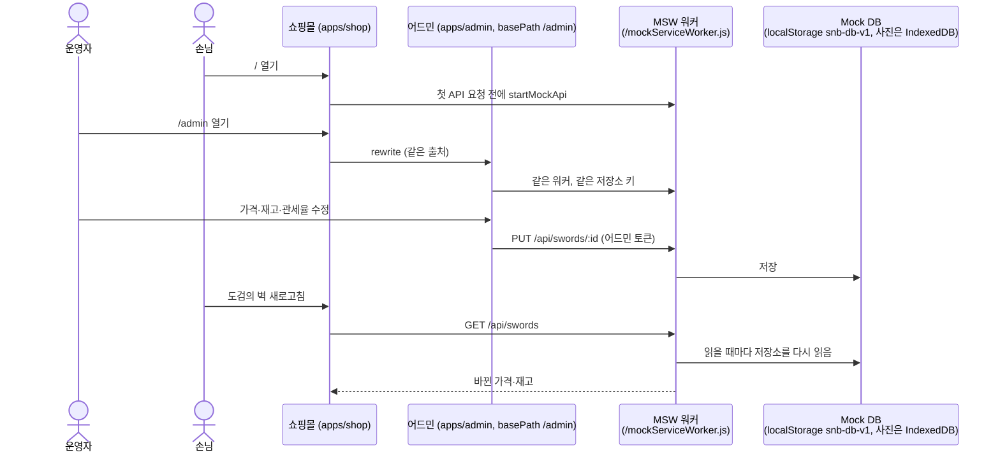
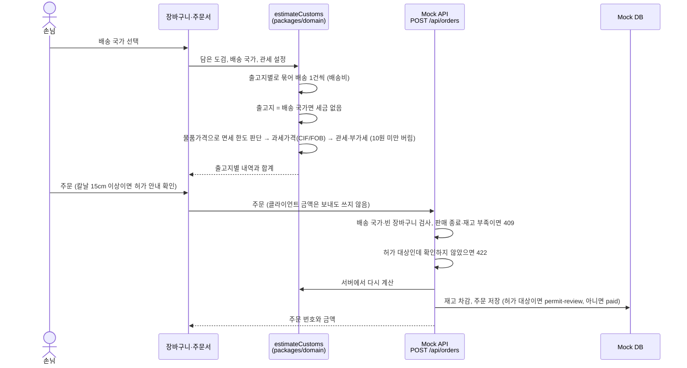
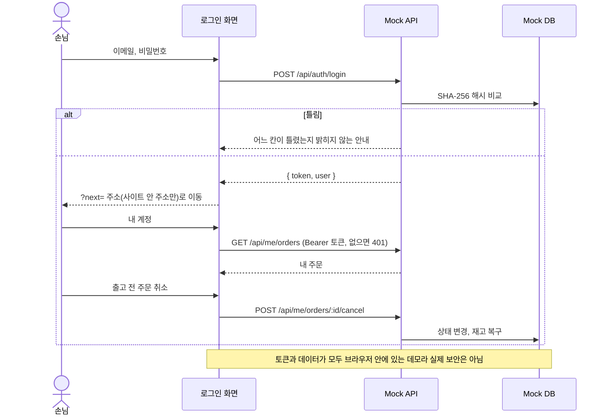

# 시퀀스 다이어그램

Sword & Blade의 주요 흐름입니다. 백엔드 대신 브라우저의 Mock API(MSW)가 응답하며, 쇼핑몰과 어드민이 한 주소(multi-zones)에서 같은 Mock DB를 함께 씁니다.

## 1. 쇼핑몰과 어드민이 데이터를 함께 쓰는 방식

```mermaid
sequenceDiagram
    actor 운영자
    actor 손님
    participant 쇼핑몰 as 쇼핑몰 (apps/shop)
    participant 어드민 as 어드민 (apps/admin, basePath /admin)
    participant 워커 as MSW 워커<br/>(/mockServiceWorker.js)
    participant DB as Mock DB<br/>(localStorage snb-db-v1, 사진은 IndexedDB)

    손님->>쇼핑몰: / 열기
    쇼핑몰->>워커: 첫 API 요청 전에 startMockApi
    운영자->>쇼핑몰: /admin 열기
    쇼핑몰->>어드민: rewrite (같은 출처)
    어드민->>워커: 같은 워커, 같은 저장소 키
    운영자->>어드민: 가격·재고·관세율 수정
    어드민->>워커: PUT /api/swords/:id (어드민 토큰)
    워커->>DB: 저장
    손님->>쇼핑몰: 도검의 벽 새로고침
    쇼핑몰->>워커: GET /api/swords
    워커->>DB: 읽을 때마다 저장소를 다시 읽음
    워커-->>쇼핑몰: 바뀐 가격·재고
```

## 2. 관세 미리 계산과 주문

```mermaid
sequenceDiagram
    actor 손님
    participant 장바구니 as 장바구니·주문서
    participant 계산 as estimateCustoms<br/>(packages/domain)
    participant 워커 as Mock API<br/>POST /api/orders
    participant DB as Mock DB

    손님->>장바구니: 배송 국가 선택
    장바구니->>계산: 담은 도검, 배송 국가, 관세 설정
    계산->>계산: 출고지별로 묶어 배송 1건씩 (배송비)
    계산->>계산: 출고지 = 배송 국가면 세금 없음
    계산->>계산: 물품가격으로 면세 한도 판단 → 과세가격(CIF/FOB) → 관세·부가세 (10원 미만 버림)
    계산-->>장바구니: 출고지별 내역과 합계
    손님->>장바구니: 주문 (칼날 15cm 이상이면 허가 안내 확인)
    장바구니->>워커: 주문 (클라이언트 금액은 보내도 쓰지 않음)
    워커->>워커: 배송 국가·빈 장바구니 검사, 판매 종료·재고 부족이면 409
    워커->>워커: 허가 대상인데 확인하지 않았으면 422
    워커->>계산: 서버에서 다시 계산
    워커->>DB: 재고 차감, 주문 저장 (허가 대상이면 permit-review, 아니면 paid)
    워커-->>장바구니: 주문 번호와 금액
```

## 3. 회원 로그인과 내 주문

```mermaid
sequenceDiagram
    actor 손님
    participant 쇼핑몰 as 로그인 화면
    participant 워커 as Mock API
    participant DB as Mock DB

    손님->>쇼핑몰: 이메일, 비밀번호
    쇼핑몰->>워커: POST /api/auth/login
    워커->>DB: SHA-256 해시 비교
    alt 틀림
        워커-->>쇼핑몰: 어느 칸이 틀렸는지 밝히지 않는 안내
    else
        워커-->>쇼핑몰: { token, user }
        쇼핑몰-->>손님: ?next= 주소(사이트 안 주소만)로 이동
        손님->>쇼핑몰: 내 계정
        쇼핑몰->>워커: GET /api/me/orders (Bearer 토큰, 없으면 401)
        워커-->>쇼핑몰: 내 주문
        손님->>쇼핑몰: 출고 전 주문 취소
        쇼핑몰->>워커: POST /api/me/orders/:id/cancel
        워커->>DB: 상태 변경, 재고 복구
    end
    Note over 쇼핑몰,DB: 토큰과 데이터가 모두 브라우저 안에 있는 데모라 실제 보안은 아님
```
